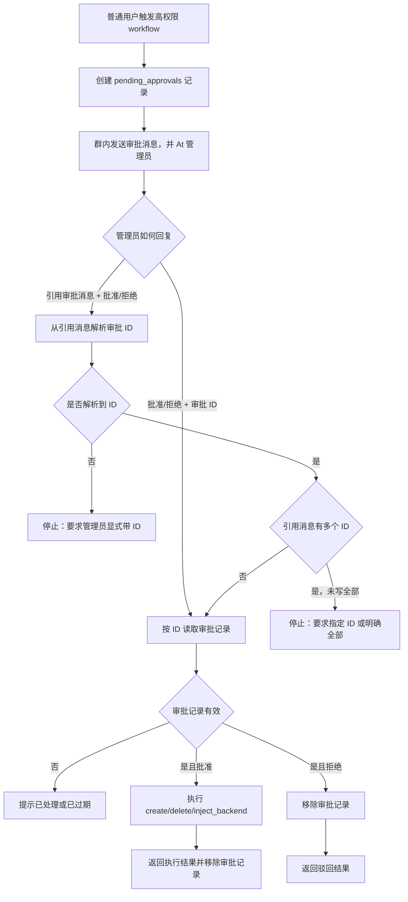

# 审批模型

高权限用户侧操作必须进入审批队列。审批模型的目标是避免普通用户直接执行破坏性操作，同时让管理员能在群聊里快速处理明确请求。

## 进入审批的动作

- `create_instance`
- `delete`
- `inject_backend`

审批记录存放在插件 KV 的 `pending_approvals` 中，处理时使用 `core.approval.claim_approval()` 原子领取，避免重复执行。

## 审批记录字段

审批参数必须包含执行所需的完整上下文：

- `manager_id`
- `instance_name`
- 操作相关参数，例如 `delete_data`、`backend_alias`、`bind_qq`
- 申请者 QQ 和群号
- 面向管理员展示的描述文本

多 manager 场景下，批准执行时必须回到审批记录中的 `manager_id`。找不到目标 manager 时返回明确错误，不回退默认面板。

## 管理员处理方式

管理员可用三种方式处理审批：

- 直接回复审批 ID：`批准 ABC123`、`拒绝 ABC123`
- 引用机器人发出的审批消息：只回复 `批准` 或 `拒绝`
- 通过 Astr 入口：`review_approvals approve ABC123`

审批回复只识别明确的开头命令：

- 批准：`批准`、`同意`、`通过`、`确认`
- 拒绝：`拒绝`、`驳回`、`否决`、`取消`

引用审批消息时，插件必须能从被引用消息文本中解析出审批 ID。如果平台未返回引用文本，需要管理员显式带 ID。

## 批量审批安全

批量审批消息可能包含多个审批 ID。引用这类消息时：

- 只回复 `批准` / `拒绝` 不会直接处理全部。
- 管理员必须带具体 ID。
- 若确实要批量处理，需要明确回复 `批准全部` 或 `拒绝全部`。

## 流程图

## 维护要求

- 新增高权限动作时，必须先判断是否应进入审批。
- 审批执行函数不得读取当前聊天上下文推断 manager 或实例。
- 审批描述可以面向人类展示，但执行只能依赖结构化参数。
- 拒绝审批不执行远端请求，只移除审批记录并返回说明。
