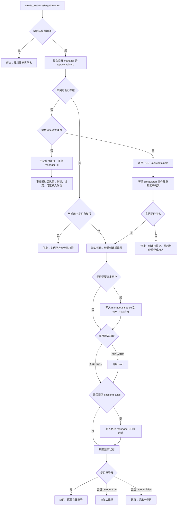
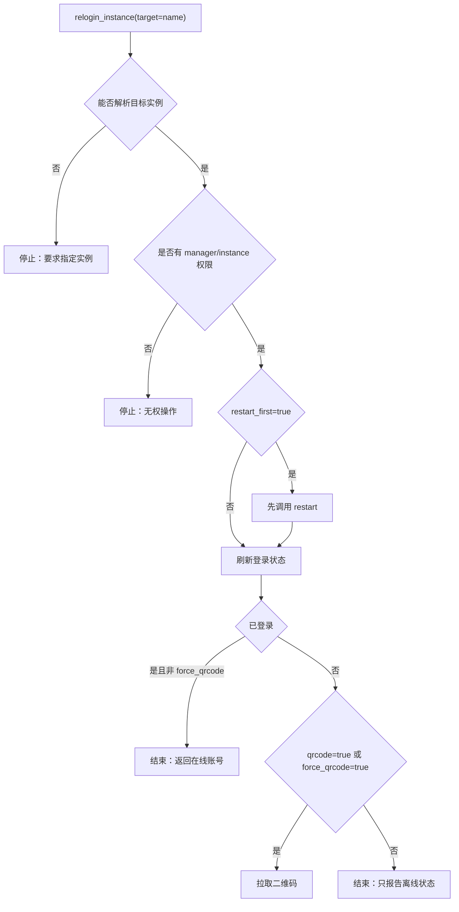
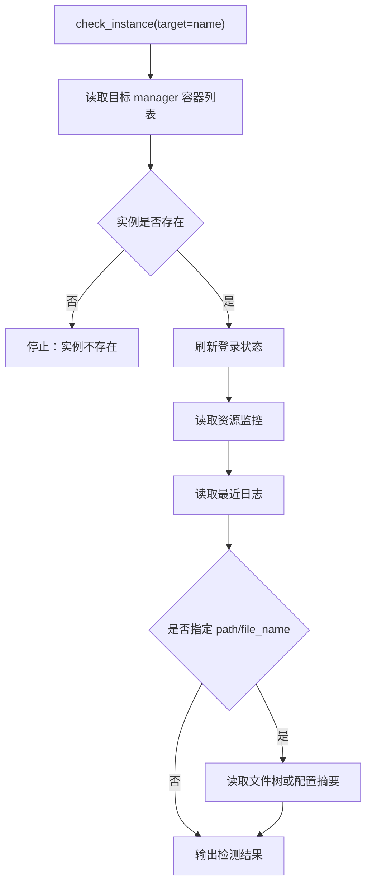
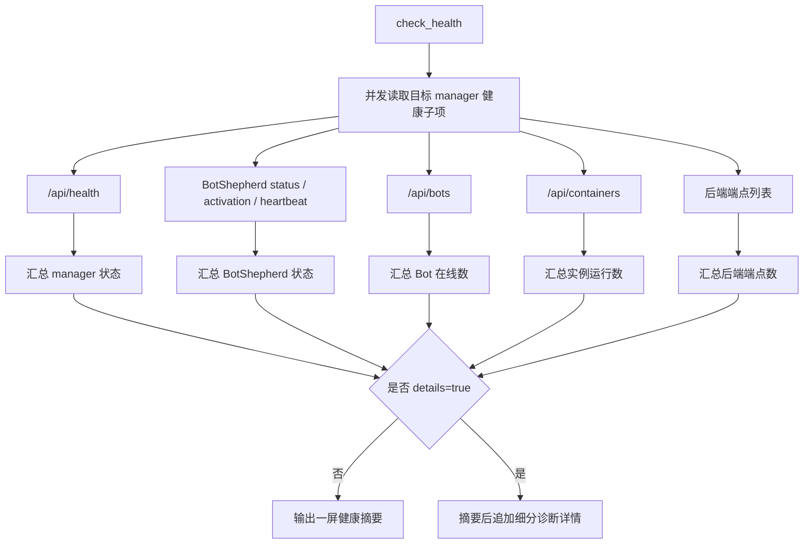
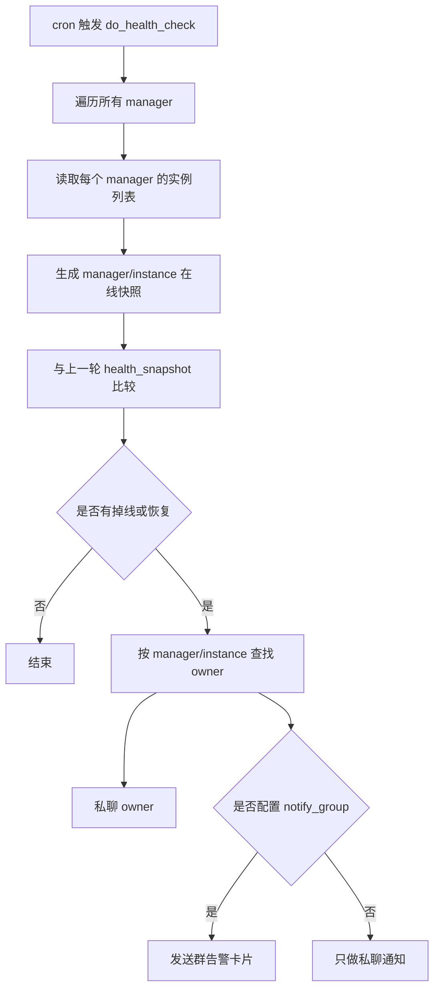

# 核心操作流程

本文记录主要 workflow 的业务顺序。修改 `workflows/instance_flows.py` 或 `workflows/admin_flows.py` 时，应同步对应流程图。

## 创建实例



推荐参数：

```json
{
  "backend_alias": "astrbot",
  "bind_qq": "123456",
  "nickname": "可选昵称",
  "qrcode": true,
  "auto_start": true
}
```

## 掉线重登



## 实例诊断



## 综合健康检查



## 定时掉线检测


