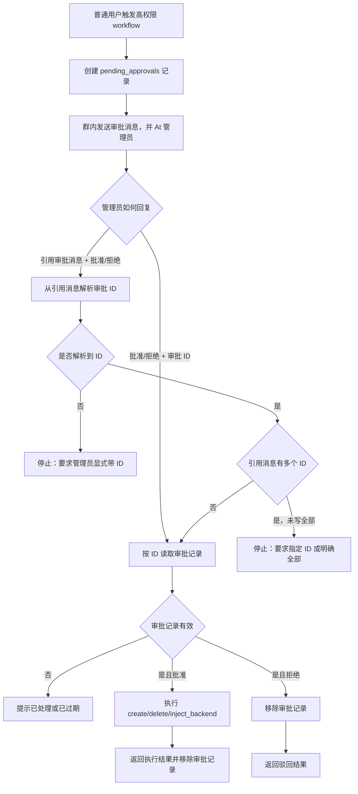
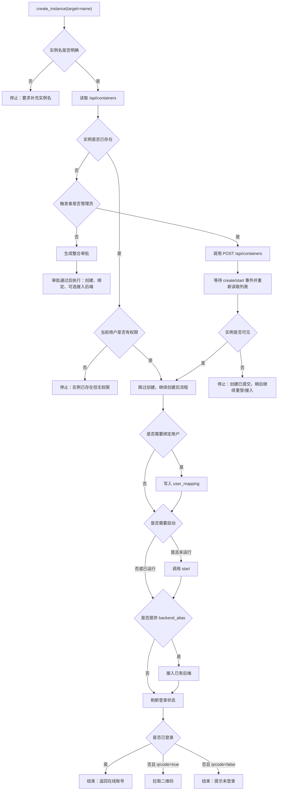
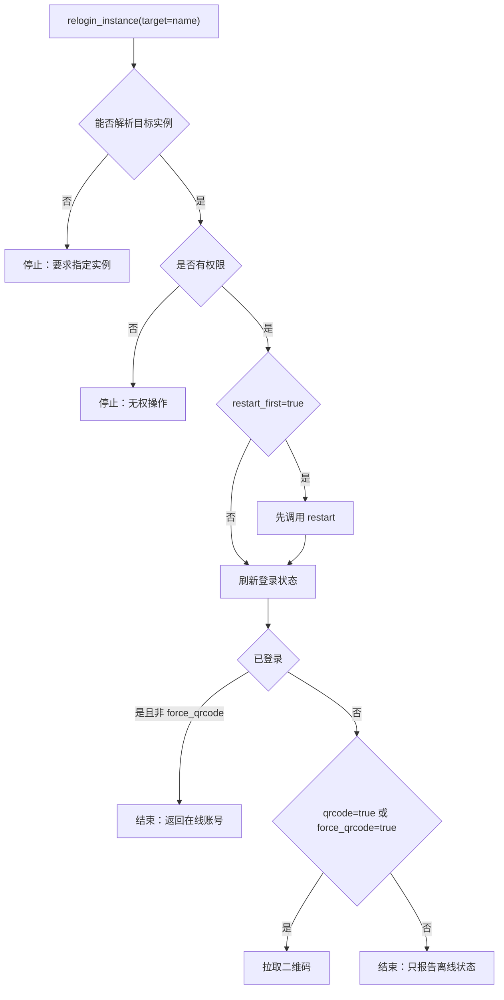
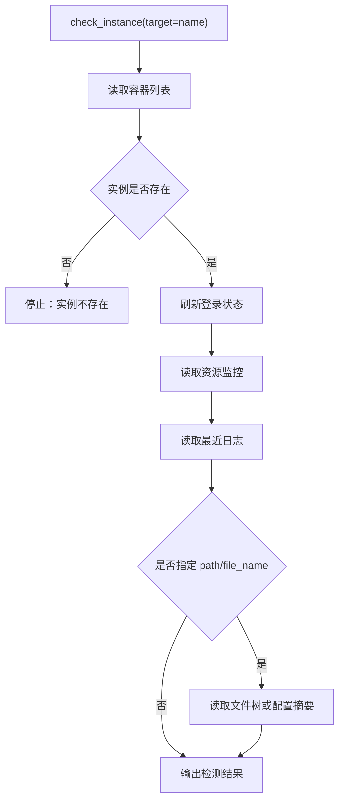
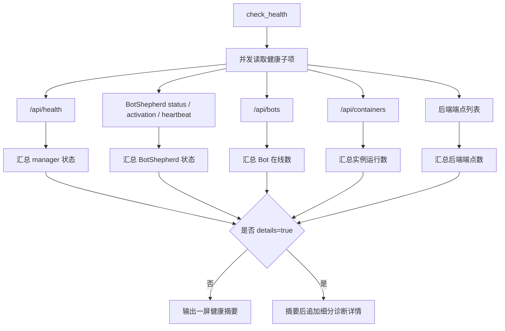

# ncqq 内部 Workflow 设计

聊天侧优先暴露少量主 workflow。模型先判断用户意图大类，再由主 workflow 根据 `intent` / `scope` 拼接到细分流程；底层 API 调用、权限判断、审批、分支条件都在流程内部完成。

核心原则：

- 主 workflow 负责聊天场景下的意图大类。
- 细分 workflow 仍可直接调用，用于确定性调试或模型已经明确知道目标流程时。
- workflow 是完整流程，不是单个 API 包装。
- 只接受新 workflow ID，不保留旧入口兼容。
- 不再把 `scope` 当作主要公开接口。
- 多面板场景下，优先在参数中带 `manager`，或把目标写成 `manager/instance`。

## 主 Workflow

| workflow | 能力方向 | 说明 |
| --- | --- | --- |
| `manage_instance` | 实例主流程 | 根据 `intent` 路由到创建、重登、控制、接后端、检测、列表、销毁 |
| `query` | 查询主流程 | 根据 `scope` 路由到实例、后端、健康、消息、审计、资源、配置查询 |
| `manage_backend` | 后端主流程 | 根据 `intent` 查看后端端点或接入后端 |
| `review_approvals` | 审批队列流程 | 管理员查看、批准或驳回待审批请求 |

## 细分 Workflow

以下入口保留直接调用能力，但默认不作为聊天侧首选：

| workflow | 能力方向 | 说明 |
| --- | --- | --- |
| `create_instance` | 创建流程 | `manage_instance intent=create` 的目标流程 |
| `relogin_instance` | 掉线重登流程 | `manage_instance intent=recover` 的目标流程 |
| `control_instance` | 控制流程 | `manage_instance intent=control/action=start|stop|restart|...` 的目标流程 |
| `connect_backend` | 后端接入流程 | `manage_instance intent=connect` 或 `manage_backend intent=connect` 的目标流程 |
| `check_instance` | 实例检测流程 | `query scope=instance` 或 `manage_instance intent=check` 的目标流程 |
| `list_instances` | 实例列表流程 | `query scope=instances` 或 `manage_instance intent=list` 的目标流程 |
| `check_backends` | 后端端点检测流程 | `query scope=backends` 或 `manage_backend intent=list` 的目标流程 |
| `check_health` | 综合健康检查流程 | `query scope=health` 的目标流程 |
| `read_bot_messages` | Bot 消息读取流程 | `query scope=messages` 的目标流程 |
| `audit_operations` | 操作审计流程 | `query scope=audit` 的目标流程 |
| `inspect_resources` | 资源检测流程 | `query scope=resources` 的目标流程 |
| `read_instance_config` | 配置读取流程 | `query scope=config` 的目标流程 |
| `delete_instance` | 销毁流程 | `manage_instance intent=delete` 的目标流程 |

## 响应群白名单

配置 `enable_group_whitelist=true` 后，插件只响应 `response_groups` 中列出的群聊。
`response_groups` 支持逗号、空格、顿号分隔多个群号。

该限制作用于：

- LLM 工具入口 `ncqq_manager`
- `/ncqq` 调试命令
- 群内审批快捷回复

私聊不受响应群白名单限制，用于管理员或绑定用户做必要排障。

## OneBot v11 群聊判定

当前正式群聊场景只按 OneBot v11 标准消息考虑，不为 WeChat 适配器做额外分支。
AstrBot 使用 `aiocqhttp` 反向 WebSocket，协议端连接 `/ws`，消息必须使用数组格式：

```json
[
  {"type": "at", "data": {"qq": "123456"}},
  {"type": "text", "data": {"text": " ncqq 当前健康状态怎么样？"}}
]
```

判定顺序：

- 原始文本显式以唤醒前缀调用 `/ncqq` 时，进入调试命令入口，例如 `/ncqq query health detail` 或 `@bot /ncqq query health detail`。
- 群内 `@bot ncqq ...` 是自然语言请求，不进入 `/ncqq` 调试命令，由 AstrBot LLM 判断是否调用 `ncqq_manager`。
- 询问“整体健康 / 管理器和实例是否正常 / 后端状态”时，优先调用 `ncqq_manager`，参数为 `workflow=query`、`params.scope=health`，需要细节时加 `params.details=true`。
- 普通聊天未提到 ncqq、NapCatQQ、实例、后端、管理器、BotShepherd 等管理语义时，不应调用本插件工具。

## 多 Manager 调用

LLM 工具和 `/ncqq` 调试命令都支持选择面板：

```json
{
  "workflow": "manage_instance",
  "target": "mybot",
  "params": {
    "manager": "cloud",
    "intent": "control",
    "action": "restart"
  }
}
```

等价目标写法：

```text
/ncqq manage_instance control restart cloud/mybot
/ncqq query health manager=cloud detail
/ncqq manage_backend connect astrbot cloud/mybot
```

权限和审批均以 `manager/instance` 为最小单元。普通用户绑定 `cloud/mybot` 后，不会自动获得默认面板同名 `mybot` 的权限。

## 群审批交互

普通用户在 QQ 群内触发高权限操作时，workflow 会创建审批记录，并用真实 At 组件提醒 AstrBot 管理员。
审批记录会进入 `pending_approvals` 任务队列；用户侧不直接执行高权限动作，等待管理员处理。
管理员通过 Astr 的 `review_approvals` / 审批队列入口读取并处理待审批任务，不做额外私聊或群外推送。

管理员可用两种方式处理审批：

- 直接回复审批 ID：`批准 ABC123`、`拒绝 ABC123`
- 引用机器人发出的审批消息：只回复 `批准` 或 `拒绝`
- 通过 Astr 入口：`review_approvals approve ABC123`、`review_approvals reject ABC123`

审批回复只识别明确的开头命令：`批准`、`同意`、`通过`、`确认`、`拒绝`、`驳回`、`否决`、`取消`。
引用审批消息时，插件必须能从被引用消息文本中解析出审批 ID；如果平台未返回引用文本，需要管理员显式带 ID。
批量审批消息包含多个审批 ID 时，引用回复 `批准` / `拒绝` 不会直接处理全部，避免误删或误接入。管理员需要带具体 ID，或明确回复 `批准全部` / `拒绝全部`。



## 选择规则

| 用户意图 | 选择 workflow |
| --- | --- |
| “创建一个实例 / 开一个 bot / 给某人开通” | `manage_instance`，`intent=create` |
| “掉线了 / 重新登录 / 获取二维码 / 扫码” | `manage_instance`，`intent=recover` |
| “重启 / 启动 / 停止 / 暂停” | `manage_instance`，`intent=control`，带 `action` |
| “把某个后端接到实例上” | `manage_backend`，`intent=connect` |
| “这个实例有什么问题 / 看日志 / 看资源占用” | `query`，`scope=instance` |
| “有哪些实例 / 当前状态” | `query`，`scope=instances` |
| “有哪些后端端点” | `query`，`scope=backends` |
| “整体健康 / 当前是否正常 / 管理器和 Bot 状态” | `query`，`scope=health` |
| “管理器 / Docker / BotShepherd / Bot 连接细节” | `query`，`scope=health`，设置 `details=true` |
| “看某个 Bot 最近消息” | `query`，`scope=messages` |
| “谁操作过 / 最近变更” | `query`，`scope=audit` |
| “有哪些镜像 / 节点资源” | `query`，`scope=resources` |
| “看配置 / 看文件” | `query`，`scope=config` |
| “删除 / 销毁实例” | `manage_instance`，`intent=delete` |
| “有哪些审批 / 批准或拒绝审批” | `review_approvals` |

## 创建流程



推荐参数：

```json
{
  "backend_alias": "astrbot",
  "bind_qq": "123456",
  "nickname": "可选昵称",
  "qrcode": true,
  "auto_start": true
}
```

## 掉线重登流程



## 实例检测流程



## 综合健康检查流程



## 调试命令

```text
ncqq manage_instance <intent> [args]
ncqq query [scope] [target]
ncqq manage_backend [list|connect] ...
ncqq create_instance <实例> [端点别名]
ncqq relogin_instance [实例]
ncqq control_instance <start|stop|restart|pause|unpause|kill> [实例]
ncqq connect_backend <端点别名> [实例]
ncqq check_instance [实例]
ncqq list_instances
ncqq check_backends
ncqq check_health [detail]
ncqq read_bot_messages <实例> [条数]
ncqq audit_operations [条数]
ncqq inspect_resources
ncqq read_instance_config <实例> [文件] [路径]
ncqq delete_instance <实例> confirm [data]
ncqq review_approvals [approve|reject <审批ID>]
```

任意命令尾部可追加 `manager=<面板ID>`。目标实例也可直接写成 `<面板ID>/<实例名>`。
