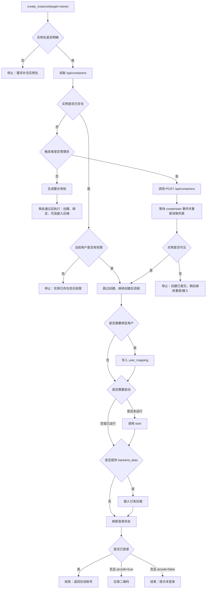
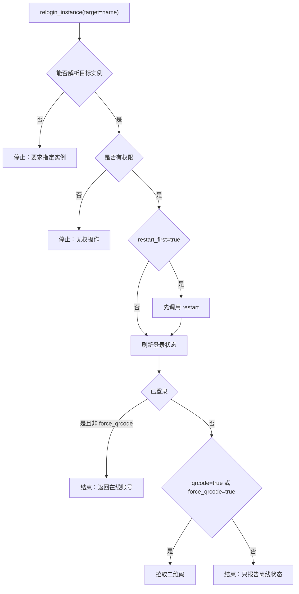
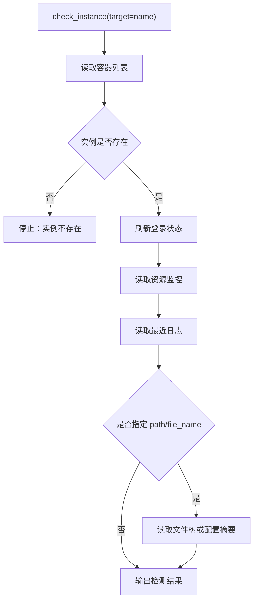

# ncqq 内部 Workflow 设计

聊天侧只暴露“按能力方向落地”的 workflow。模型先判断用户意图，再选择一个具体 workflow；底层 API 调用、权限判断、审批、分支条件都在该 workflow 内部完成。

核心原则：

- 一个 workflow 只负责一个能力方向。
- workflow 是完整流程，不是单个 API 包装。
- 只接受新 workflow ID，不保留旧入口兼容。
- 不再把 `scope` 当作主要公开接口。

## 公开 Workflow

| workflow | 能力方向 | 说明 |
| --- | --- | --- |
| `create_instance` | 创建流程 | 创建或接续创建实例，按条件绑定用户、启动实例、接入后端、拉二维码 |
| `relogin_instance` | 掉线重登流程 | 检查登录状态，离线时拉二维码，可选先重启 |
| `control_instance` | 控制流程 | 启动、停止、重启、暂停、恢复、强杀 |
| `connect_backend` | 后端接入流程 | 校验端点别名和目标实例，再注入已有后端 |
| `check_instance` | 实例检测流程 | 检查实例存在、登录、资源、日志，可选文件/配置 |
| `list_instances` | 实例列表流程 | 查看实例状态和绑定关系 |
| `check_backends` | 后端端点检测流程 | 查看已配置后端端点，不显示 token 明文 |
| `check_manager` | 管理器健康检测流程 | 检测 ncqq-manager、Docker、状态引擎等 |
| `check_botshepherd` | BotShepherd 检测流程 | 检测 BotShepherd 进程、激活、心跳 |
| `check_bot_runtime` | Bot 运行态检测流程 | 查看 Bot WS 连接与账号运行态 |
| `read_bot_messages` | Bot 消息读取流程 | 读取指定 Bot 最近消息 |
| `audit_operations` | 操作审计流程 | 查看最近操作日志 |
| `inspect_resources` | 资源检测流程 | 查看镜像与节点资产 |
| `read_instance_config` | 配置读取流程 | 查看实例文件树和指定配置文件 |
| `delete_instance` | 销毁流程 | 显式确认后删除实例，可选删除数据目录 |
| `review_approvals` | 审批队列流程 | 管理员查看待审批请求 |

## 选择规则

| 用户意图 | 选择 workflow |
| --- | --- |
| “创建一个实例 / 开一个 bot / 给某人开通” | `create_instance` |
| “掉线了 / 重新登录 / 获取二维码 / 扫码” | `relogin_instance` |
| “重启 / 启动 / 停止 / 暂停” | `control_instance` |
| “把某个后端接到实例上” | `connect_backend` |
| “这个实例有什么问题 / 看日志 / 看资源占用” | `check_instance` |
| “有哪些实例 / 当前状态” | `list_instances` |
| “有哪些后端端点” | `check_backends` |
| “管理器健康 / Docker 是否正常” | `check_manager` |
| “BotShepherd 是否正常” | `check_botshepherd` |
| “Bot 是否连接 / 账号运行态” | `check_bot_runtime` |
| “看某个 Bot 最近消息” | `read_bot_messages` |
| “谁操作过 / 最近变更” | `audit_operations` |
| “有哪些镜像 / 节点资源” | `inspect_resources` |
| “看配置 / 看文件” | `read_instance_config` |
| “删除 / 销毁实例” | `delete_instance` |
| “有哪些审批” | `review_approvals` |

## 创建流程



推荐参数：

```json
{
  "backend_alias": "astrbot",
  "bind_qq": "123456",
  "nickname": "可选昵称",
  "qrcode": true,
  "auto_start": true
}
```

## 掉线重登流程



## 实例检测流程



## 调试命令

```text
ncqq create_instance <实例> [端点别名]
ncqq relogin_instance [实例]
ncqq control_instance <start|stop|restart|pause|unpause|kill> [实例]
ncqq connect_backend <端点别名> [实例]
ncqq check_instance [实例]
ncqq list_instances
ncqq check_backends
ncqq check_manager
ncqq check_botshepherd
ncqq check_bot_runtime
ncqq read_bot_messages <实例> [条数]
ncqq audit_operations [条数]
ncqq inspect_resources
ncqq read_instance_config <实例> [文件] [路径]
ncqq delete_instance <实例> confirm [data]
ncqq review_approvals
```
